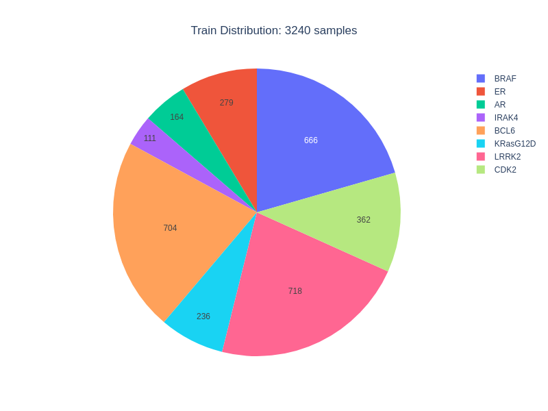
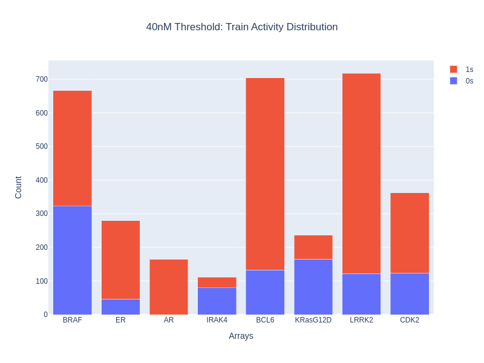
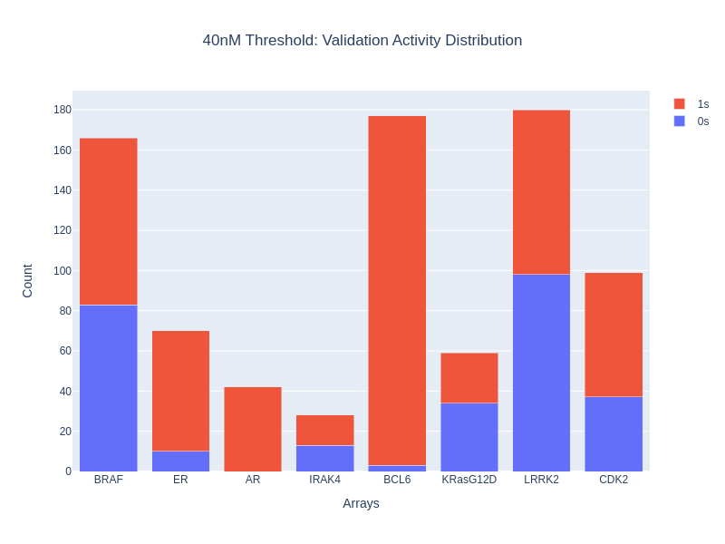
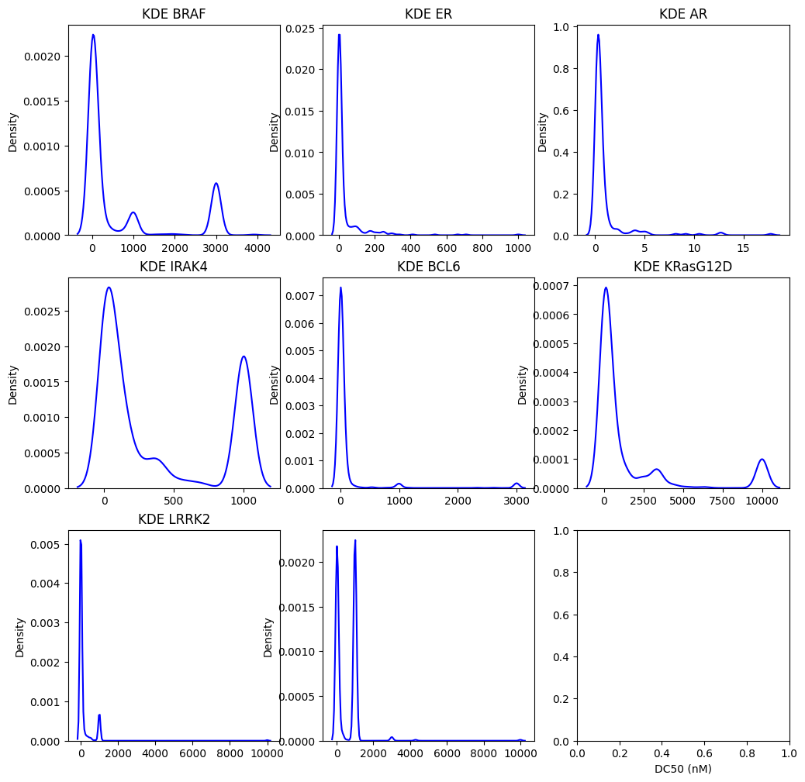
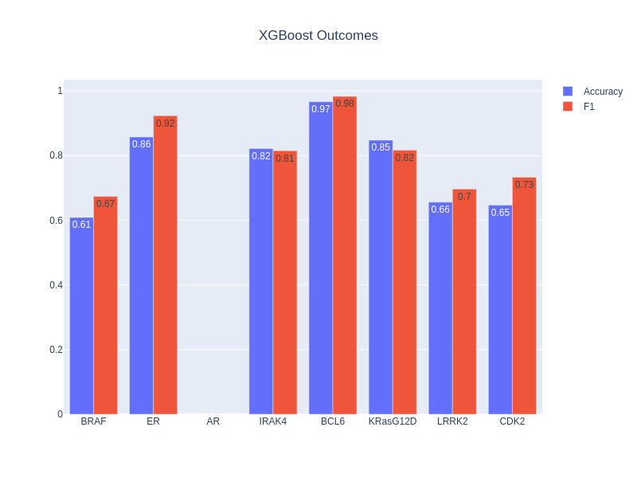
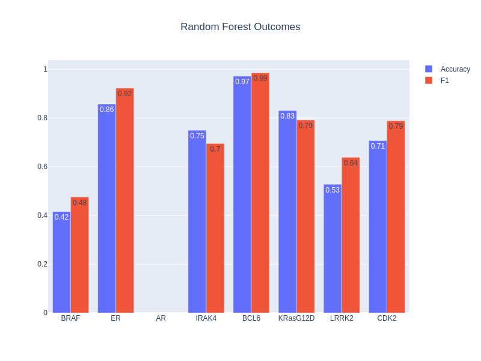
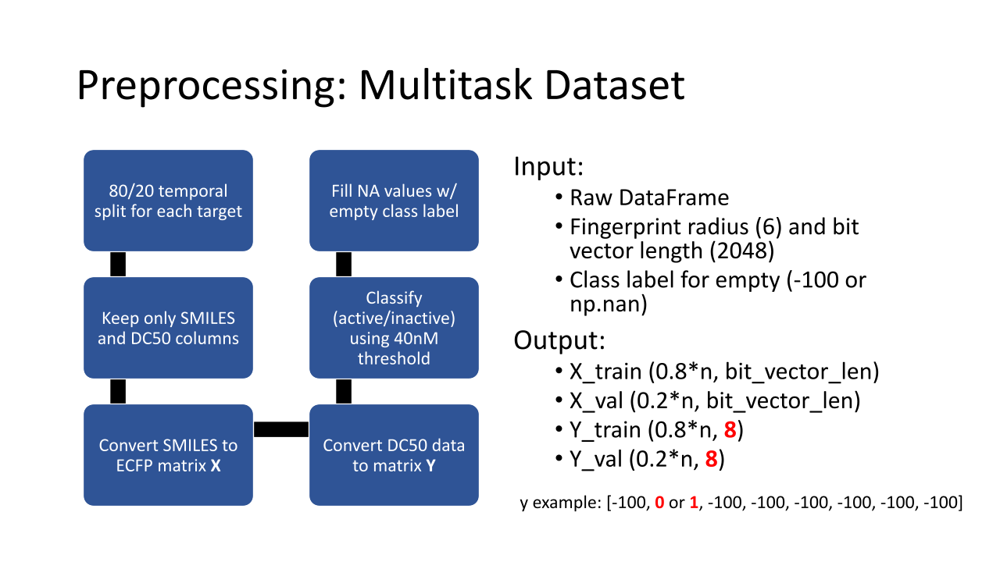
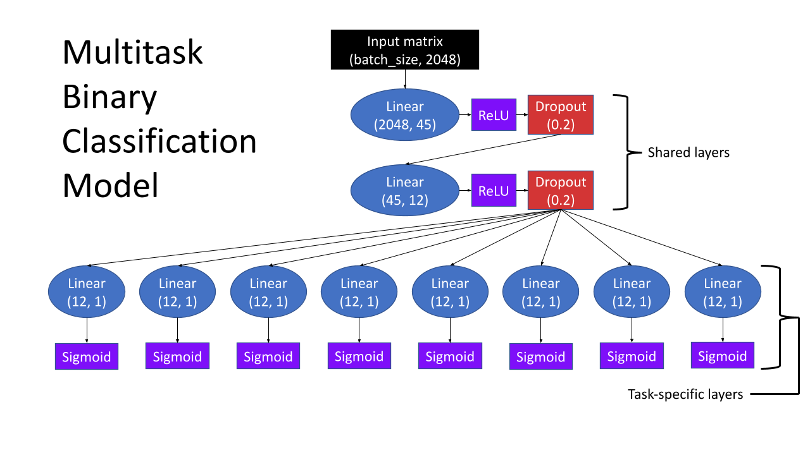

# Predictive Modeling of PROTACs using Degradation Data
Published with permission from Arvinas.
Applying multitask learning to the linkerology data across 8 protein targets.

1. Comparing results w/ Random Forest, XGBoost, and single-target neural-net, binary and regression.
2. Comparing ECFP from parent PROTAC structures with ECFP from **component** PROTAC structures. Where **component** refers to a bit_vector_len*3 matrix with rows: (target_ligand, linker, e3_ligand).
3. Comparing multitask vs. single-task vs. single-task w/ pre-loaded parameters from trained multitask model (with shared layer parameters either frozen or not).

---
## Target-independent temporal split
80/20 split, where the top 20% newest compounds are placed in the validation set to enchance the robustness of future predictions. Split was performed independently for each target.

## Binarization
Due to a heavy skew towards active compounds, a relatively low 40nM threshold was chosen.

Use of kernel density estimation for "auto-thresholding" was explored, but could not produce useful thresholds for most of the targets.

## Classical Modeling Results
Trained a **XGBoost** model and a **random forest** model for each target independently using grid-search and 3-fold CV.
*The models were not trained with AR data since it is entirely active.*

## Multitask Neural Network

## linkerology_multitask pip package

Contains datastructures and functions for data processing, model architecture, training routines, and visualization.
Create a virtual-env and install package from within this repository root directory using **pip install -e linkerology_multitask**. "linkerology_multitask" would be replaced w/ the path to the package directory if not installing within the repo root. "-e" flag installs in editable mode so that changes can be made within the package and directly noticed by the virtual-env.
Importing linkerology_multitask may require installation of additional packages to the virtual-env.

---

## linkerology_multitask.dataset_creation

Module within linkerology_multitask for building ML numpy datasets from data in DATA/raw into DATA/processed.

---

## linkerology_multitask.ml_models

Module within linkerology_multitask for machine learning model architecure using PyTorch.
BinaryMultitask using Sigmoid output, MulticlassMultitask uses Softmax output (for binary classification), and RegMultitask uses nn.Linear (node:1) output for regression.
BinaryMultitask is used for linkerology_multitask.ml_training.MultitaskTrainerBinary rather and MulticlassMultitask is not used.

---

## linkerology_multitask.ml_training

Module within linkerology_multitask for training the machine learning models.
MultitaskTrainerBinary and MultitaskTrainerReg inherit from _Trainer. Hyperparameters are modifiable here within their constructors (or as properties after instantiation).
The trainers will track metrics such as: accuracy, F1, R squared over epochs. They will also save the models best weights by taking the minimum of the loss over epochs.
